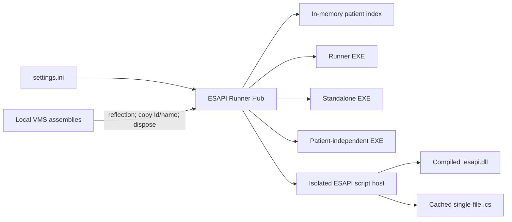

# ESAPI Runner Hub


ESAPI Runner Hub is a portable Windows catalogue for launching ESAPI runner applications, standalone executables, compiled ESAPI binaries, and single-file C# scripts from one place. It loads the Eclipse patient directory once, searches the detached local index immediately, lets the user choose course, plan, plan sum, structure set, or image context, and keeps every application isolated in its own process.

The launcher package is vendor-free: the repository and release package contain no Varian/VMS or EsapiEssentials binary files. The entry executable declares only the VMS API metadata reference required for standalone ESAPI authorization and is built against Eclipse 18 metadata. On a workstation without ESAPI it starts in offline catalogue mode, so patient-independent tools and optional tools can still run.

> This project is research and workflow infrastructure, not a medical device. Every configured target application keeps its own validation, authorization, write-access, and clinical-use requirements.

## Why a hub?

ESAPI applications commonly grow as separate runner EXEs with different paths and patient-selection behavior. A shared hub makes the available tools visible, removes repeated launcher navigation, and limits the blast radius of a crashing child process. It does not execute clinical scripts in-process.



## Features

- Fast tokenized patient search after a one-time detached directory load.
- No retained ESAPI patient, course, plan, or `ScriptContext` object.
- Optional patient-ID transfer by argument or child-only environment variable.
- Applications that require, optionally accept, or ignore a patient context.
- Direct context launch for supported `.esapi.dll` and `.cs` scripts through a separate Eclipse 18 host process, while reference-only cards remain available for scripts that must still start inside Eclipse.
- Reusable selection of course, plan, plan sum, structure set, or image, including scripts that work without a plan.
- Catalogue filters for standalone, single-file, and binary tools, plus visible artifact type, read/write intent, compact source path, and optional STR Hub README link.
- A DPAPI-protected local activity history with current status and **Run again**; context identifiers are encrypted for the current Windows account and commands are always recomposed from current settings.
- Explicit save/discard confirmation after every write-enabled direct context script.
- Multiple sequential or overlapping child processes; non-zero exits and crashes do not close the Hub.
- Independent asynchronous path checks with explicit missing/local and unavailable/network states.
- A graphical settings editor for the same portable `settings.ini` used at runtime.
- Privacy-safe per-process technical logs without patient names, IDs, search text, expanded arguments, environment values, or child output; Script Host failures add only their execution phase, safe reason code, and exception type. A bounded background queue keeps unavailable network storage off the UI and launch path, while a local Script Host copy remains available if the configured central path fails.
- Synthetic `--offline-ui-smoke` mode for screenshots and UI checks.
- x64 .NET Framework 4.8 launcher and isolated script-host binaries with a shared window/taskbar icon.

## Install and run

1. Download the Windows x64 release ZIP and extract it to a normal folder.
2. Copy `settings.example.ini` to `settings.ini` next to `ESAPI-Runner-Hub.exe`.
3. Open **Settings** in the Hub and select the local ESAPI API/Types assemblies and application EXEs. A valid configured pair is used first; if it is missing or outdated, the Hub automatically tries the highest complete local Varian RTM installation under Program Files.
4. Save, then search for a patient or start an application without a patient as permitted by its card.

An alternative settings file can be supplied explicitly:

```powershell
ESAPI-Runner-Hub.exe --settings D:\PortableTools\runner-hub.ini
```

The UI-only synthetic demonstration never loads ESAPI:

```powershell
ESAPI-Runner-Hub.exe --offline-ui-smoke
```

### Direct context debugging

The same executable can start a configured context script without opening the Hub window. The most convenient option repeats the latest DPAPI-protected context saved for that application ID:

```powershell
ESAPI-Runner-Hub.exe --replay-latest plugin-fb-info --settings .\settings.ini
```

For exact cross-VDA Citrix debugging, use a shared request instead of `latest`. The request JSON contains the requesting Windows SID, application, and one or more explicit patient/planning contexts; the Runner writes a matching result JSON with VDA and exit code. The request directory is configured as `Hub.ContextRequestDirectory` and defaults to the `requests` child of the readable log tree. From a configured workstation:

```powershell
.\tools\Invoke-CitrixContextDebug.ps1 -ApplicationId plugin-color-code -PatientId PATIENT-ID -CourseId C7 -PlanId PLAN-ID
```

The helper writes a Windows-SID-specific pending marker and opens the normal published Citrix shortcut without extra client parameters. On the assigned VDA the versioned Runner atomically claims that marker, verifies the same SID in `<request-id>.request.json`, runs the context script through the isolated Script Host, and writes `<request-id>.result.json`. Another Windows identity cannot claim or directly execute the request. The pending marker is available for at most 30 seconds by default and normally disappears within seconds; request and result JSON remain as readable protected history. A direct VDA shell may still use `--run-request <request-id>`, subject to the same SID check.

See [Context and Citrix debugging](docs/CONTEXT_DEBUGGING.md) for the complete request contract, direct VDA commands, series behavior, result fields, and an automation-oriented procedure.

For an explicit context, place the identifiers in process environment variables rather than command-line arguments:

```powershell
$env:ESAPI_RUNNER_CONTEXT_PATIENT = 'PATIENT-ID'
$env:ESAPI_RUNNER_CONTEXT_COURSE = 'COURSE-ID'
$env:ESAPI_RUNNER_CONTEXT_PLAN = 'PLAN-ID'
$env:ESAPI_RUNNER_CONTEXT_STRUCTURE_SET = 'STRUCTURE-SET-ID'
$env:ESAPI_RUNNER_CONTEXT_IMAGE = 'IMAGE-ID'
ESAPI-Runner-Hub.exe --run-context plugin-fb-info --settings .\settings.ini
Remove-Item Env:ESAPI_RUNNER_CONTEXT_PATIENT, Env:ESAPI_RUNNER_CONTEXT_COURSE, Env:ESAPI_RUNNER_CONTEXT_PLAN, Env:ESAPI_RUNNER_CONTEXT_STRUCTURE_SET, Env:ESAPI_RUNNER_CONTEXT_IMAGE
```

Plan sums use `ESAPI_RUNNER_CONTEXT_PLAN_SUM`. Optional semicolon-separated scopes use `ESAPI_RUNNER_CONTEXT_PLAN_SCOPE` and `ESAPI_RUNNER_CONTEXT_PLAN_SUM_SCOPE`. Identifiers are transferred only through the child environment and are not written to the command line or technical log. The command waits for the isolated Script Host and returns its exit code.

For an ordered series of explicit contexts, provide one JSON envelope through the private process environment and use `--run-contexts`:

```powershell
$contexts = @{
    Contexts = @(
        @{ PatientId = 'PATIENT-A'; CourseId = 'C1'; PlanId = 'P1' },
        @{ PatientId = 'PATIENT-B'; CourseId = 'C2'; PlanId = 'P2' }
    )
}
$env:ESAPI_RUNNER_CONTEXTS = $contexts | ConvertTo-Json -Depth 4 -Compress
ESAPI-Runner-Hub.exe --run-contexts plugin-fb-info --settings .\settings.ini
Remove-Item Env:ESAPI_RUNNER_CONTEXTS
```

Each entry also accepts `PlanSumId`, `StructureSetId`, `ImageId`, `PlanIdsInScope`, and `PlanSumIdsInScope`. The Hub starts one isolated host at a time, stops at the first non-zero exit, and accepts at most 100 entries. Series are restricted to applications configured with `WriteMode=ReadOnly`; write-enabled scripts remain deliberate single-context interactions.

### Stable Citrix launcher

For a published Citrix application, use `citrix\ESAPI-Runner-Hub.CitrixLauncher.exe` as the stable executable. The small launcher reads `citrix\current.txt`, starts only the selected immutable binary from `dist\versions`, passes the shared `dist\settings.ini` explicitly, waits for the child process, and propagates its exit code. It never invokes a command shell.

The launcher can forward a Runner option supplied directly on the VDA, but productive automation does not assume that Citrix Workspace transports client-side command-line parameters. Exact workstation-driven tests use the shared request plus per-user pending marker described above and open the ordinary published shortcut without arguments. Argument contents are never logged. The legacy `cmd.exe` plus `citrix\Start-ESAPI-Runner-Hub.cmd` route remains available as a no-argument fallback.

New releases use a new filename such as `ESAPI-Runner-Hub.v0.2.9.exe`. Activating or rolling back a release changes only `current.txt`; an older binary may remain open without blocking deployment of the next version. Clinic-specific Studio values and operational commands are documented in `citrix\README-Citrix.md` and are intentionally excluded from the public package documentation.

## Configuration

Paths may be absolute, relative to the INI file, or use Windows environment variables. Executable targets start directly; explicitly configured context scripts are delegated to the adjacent `ESAPI-Script-Host.exe`. Arbitrary shell text and URLs are not launch targets.

Patient modes:

- `None`: the selected Hub patient is ignored.
- `Optional`: starting without a patient is allowed; a second patient-aware action is shown when a transport is configured.
- `Required`: launch remains disabled until a patient is selected and a transport is configured.

Patient transports:

- `None`: suitable for an existing runner that performs its own patient/plan selection.
- `Argument`: `{PatientId}` in `PatientArgumentTemplate` is replaced with a validated ID.
- `Environment`: the ID is set only for the child under `PatientEnvironmentKey`.

Launch kinds:

- `Executable`: starts an isolated external `.exe` process.
- `EclipsePlugin`: catalogues a `.esapi.dll` or `.cs` plug-in for Eclipse under **Tools > Scripts**. When `PatientMode=Required` plus a context contract is configured, the same card also starts it through the isolated host; otherwise it remains a reference-only card.
- `EsapiContextScript`: starts a supported `.esapi.dll` or `.cs` script in the isolated host using the selected patient/planning context. `ContextRequirement`, `ScopeMode`, `ScriptEngine`, and `WriteMode` define the contract.

Catalogue metadata can be explicit (`ArtifactKind`, `AccessMode`, and `HubScriptId`) or inferred conservatively. The live `settings.ini` remains editable in the Settings window, including ESAPI assembly paths, script-host path, STR Hub base URL, history path, and retention.

Single-file sources are compiled into a per-user local cache keyed by source and reference content. Compiled binaries and sources use the same context resolver. A write-enabled entry must declare `WriteMode=ConfirmSave`; the host never saves automatically and asks again on every launch and relaunch.

The fully expanded command line and environment value are never displayed or logged. See [settings.example.ini](settings.example.ini) for complete examples.

## ESAPI behavior

The launcher declares a non-copying compile-time reference to `VMS.TPS.Common.Model.API` because ESAPI rejects a purely reflection-based standalone entry assembly. The current release is compiled and validated against Eclipse 18 API metadata. It still locates and loads the configured API assembly by reflection on a dedicated STA thread, calls `Application.CreateApplication()`, copies `PatientSummaries` into plain strings, and disposes the ESAPI application immediately. Local filtering then uses only detached records. If the configured assembly pair is unavailable, it checks the locally installed Varian RTM versions in descending order and uses the first complete API/Types pair.

No live ESAPI object is retained in the Hub. A direct child opens the selected identifiers afresh in its own ESAPI session and closes that session after execution. A patient-aware standalone EXE must still implement its configured argument or environment contract.

## Privacy and resilience

Patient names, search text, commands, environments, and child output are not persisted. Recent launch identifiers needed for **Run again** are serialized minimally and encrypted with Windows DPAPI in `CurrentUser` scope; the default local file retains at most 100 records for 30 days. Logs contain UTC time, event category, configured application ID, and exception type only. A slow optional UNC path disables only its own application card.

Crash isolation protects the Hub from child failures; it does not guarantee that every pair of ESAPI applications may safely access Eclipse concurrently. Follow the validation and concurrency requirements of each target application.

## Build and test

Requirements: Windows x64, Visual Studio/MSBuild with the .NET Framework 4.8 targeting pack, and PowerShell 5.1 or newer.

```powershell
MSBuild.exe ESAPI-Runner-Hub.sln /t:Rebuild /p:Configuration=Release /p:Platform=x64 /p:EsapiReferenceDirectory="C:\Program Files (x86)\Varian\RTM\18.0\esapi\API"
.\tests\ESAPI.RunnerHub.Tests\bin\x64\Release\ESAPI.RunnerHub.Tests.exe
```

The release pipeline runs the same tests, verifies the package is vendor-free, and creates deterministic ZIP and SHA-256 artifacts:

```powershell
powershell -ExecutionPolicy Bypass -File .\tools\build-release.ps1
```

## Validation status

Automated tests use only synthetic data and a synthetic VMS-shaped assembly. Live Eclipse validation is a separate local gate; see [Clinical validation checklist](docs/CLINICAL_VALIDATION.md). A successful public build is not evidence of clinical validation.

## License

MIT. Varian, Eclipse, and ESAPI are trademarks of their respective owners and are not affiliated with this project.
