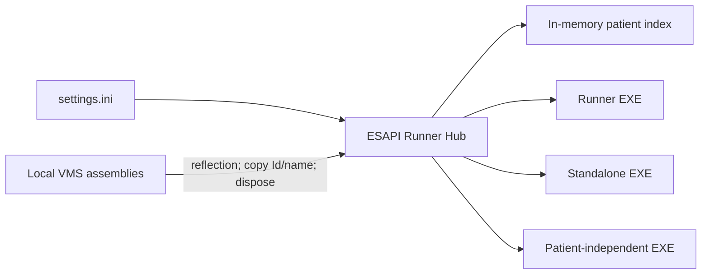

# ESAPI Runner Hub


ESAPI Runner Hub is a portable Windows catalogue for launching ESAPI runner applications and standalone executables from one place. It can load the Eclipse patient directory once, search the detached local index immediately, retain an optional patient selection across several launches, and keep every child application isolated in its own process.

The launcher is vendor-free: the repository and release package contain no Varian/VMS or EsapiEssentials assemblies. On a workstation without ESAPI it starts in offline catalogue mode, so patient-independent tools and optional tools can still run.

> This project is research and workflow infrastructure, not a medical device. Every configured target application keeps its own validation, authorization, write-access, and clinical-use requirements.

## Why a hub?

ESAPI applications commonly grow as separate runner EXEs with different paths and patient-selection behavior. A shared hub makes the available tools visible, removes repeated launcher navigation, and limits the blast radius of a crashing child process. It does not execute clinical scripts in-process.



## Features

- Fast tokenized patient search after a one-time detached directory load.
- No retained ESAPI patient, course, plan, or `ScriptContext` object.
- Optional patient-ID transfer by argument or child-only environment variable.
- Applications that require, optionally accept, or ignore a patient context.
- Multiple sequential or overlapping child processes; non-zero exits and crashes do not close the Hub.
- Independent asynchronous path checks with explicit missing/local and unavailable/network states.
- A graphical settings editor for the same portable `settings.ini` used at runtime.
- Privacy-safe technical logs without patient names, IDs, search text, expanded arguments, environment values, or child output.
- Synthetic `--offline-ui-smoke` mode for screenshots and UI checks.
- x64 .NET Framework 4.8 single-EXE launcher with its own window/taskbar icon.

## Install and run

1. Download the Windows x64 release ZIP and extract it to a normal folder.
2. Copy `settings.example.ini` to `settings.ini` next to `ESAPI-Runner-Hub.exe`.
3. Open **Settings** in the Hub and select the local ESAPI API/Types assemblies and application EXEs.
4. Save, then search for a patient or start an application without a patient as permitted by its card.

An alternative settings file can be supplied explicitly:

```powershell
ESAPI-Runner-Hub.exe --settings D:\PortableTools\runner-hub.ini
```

The UI-only synthetic demonstration never loads ESAPI:

```powershell
ESAPI-Runner-Hub.exe --offline-ui-smoke
```

## Configuration

Paths may be absolute, relative to the INI file, or use Windows environment variables. Only `.exe` targets are launched; arbitrary shell text, scripts, URLs, and plug-in DLLs are deliberately unsupported.

Patient modes:

- `None`: the selected Hub patient is ignored.
- `Optional`: starting without a patient is allowed; a second patient-aware action is shown when a transport is configured.
- `Required`: launch remains disabled until a patient is selected and a transport is configured.

Patient transports:

- `None`: suitable for an existing runner that performs its own patient/plan selection.
- `Argument`: `{PatientId}` in `PatientArgumentTemplate` is replaced with a validated ID.
- `Environment`: the ID is set only for the child under `PatientEnvironmentKey`.

The fully expanded command line and environment value are never displayed or logged. See [settings.example.ini](settings.example.ini) for complete examples.

## ESAPI behavior

The launcher has no compile-time reference to `VMS.TPS.*`. It loads the configured API assembly by reflection on a dedicated STA thread, calls `Application.CreateApplication()`, copies `PatientSummaries` into plain strings, and disposes the ESAPI application immediately. Local filtering then uses only detached records.

Version 0.1 does not search courses/plans or pass live ESAPI objects to a child. A classic Eclipse plug-in DLL needs its own compatible runner EXE before it can be registered. A patient-aware standalone EXE must explicitly implement the configured argument or environment contract.

## Privacy and resilience

Patient records and recent selections are not persisted. Logs contain UTC time, event category, configured application ID, and exception type only. Child stdout/stderr is not captured. A slow optional UNC path disables only its own application card.

Crash isolation protects the Hub from child failures; it does not guarantee that every pair of ESAPI applications may safely access Eclipse concurrently. Follow the validation and concurrency requirements of each target application.

## Build and test

Requirements: Windows x64, Visual Studio/MSBuild with the .NET Framework 4.8 targeting pack, and PowerShell 5.1 or newer.

```powershell
MSBuild.exe ESAPI-Runner-Hub.sln /t:Rebuild /p:Configuration=Release /p:Platform=x64
.\tests\ESAPI.RunnerHub.Tests\bin\x64\Release\ESAPI.RunnerHub.Tests.exe
```

The release pipeline runs the same tests, verifies the package is vendor-free, and creates deterministic ZIP and SHA-256 artifacts:

```powershell
powershell -ExecutionPolicy Bypass -File .\tools\build-release.ps1
```

## Validation status

Automated tests use only synthetic data and a synthetic VMS-shaped assembly. Live Eclipse validation is a separate local gate; see [Clinical validation checklist](docs/CLINICAL_VALIDATION.md). A successful public build is not evidence of clinical validation.

## License

MIT. Varian, Eclipse, and ESAPI are trademarks of their respective owners and are not affiliated with this project.
